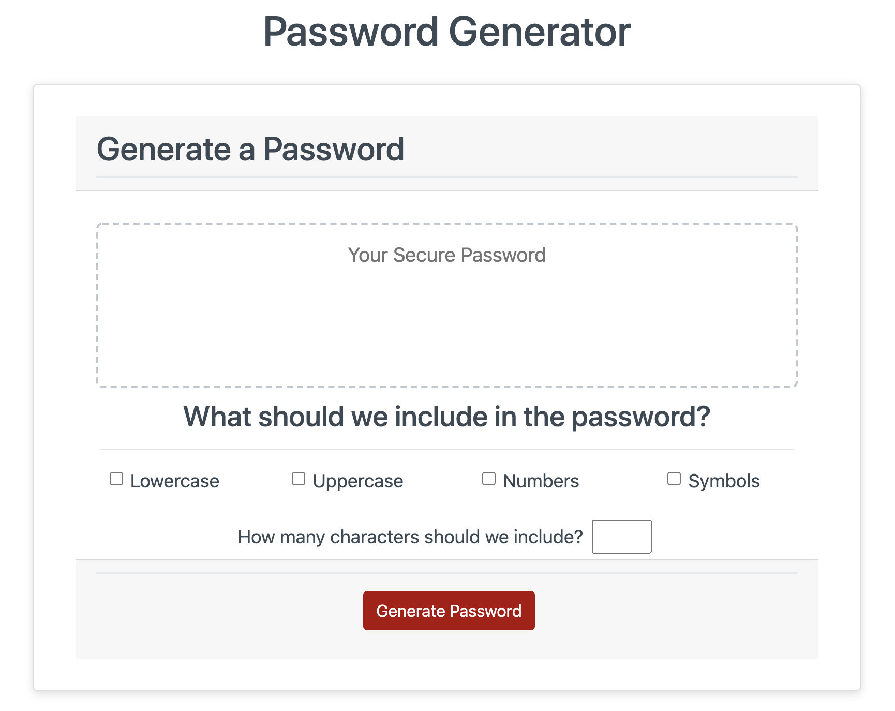
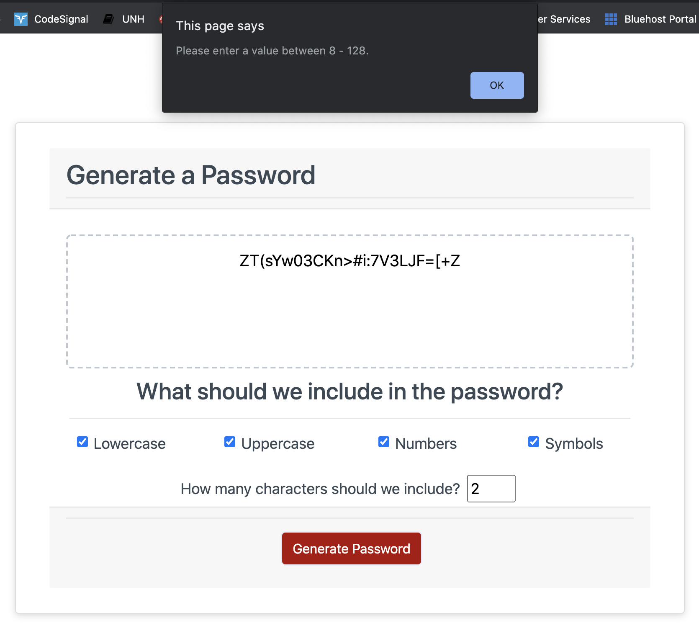
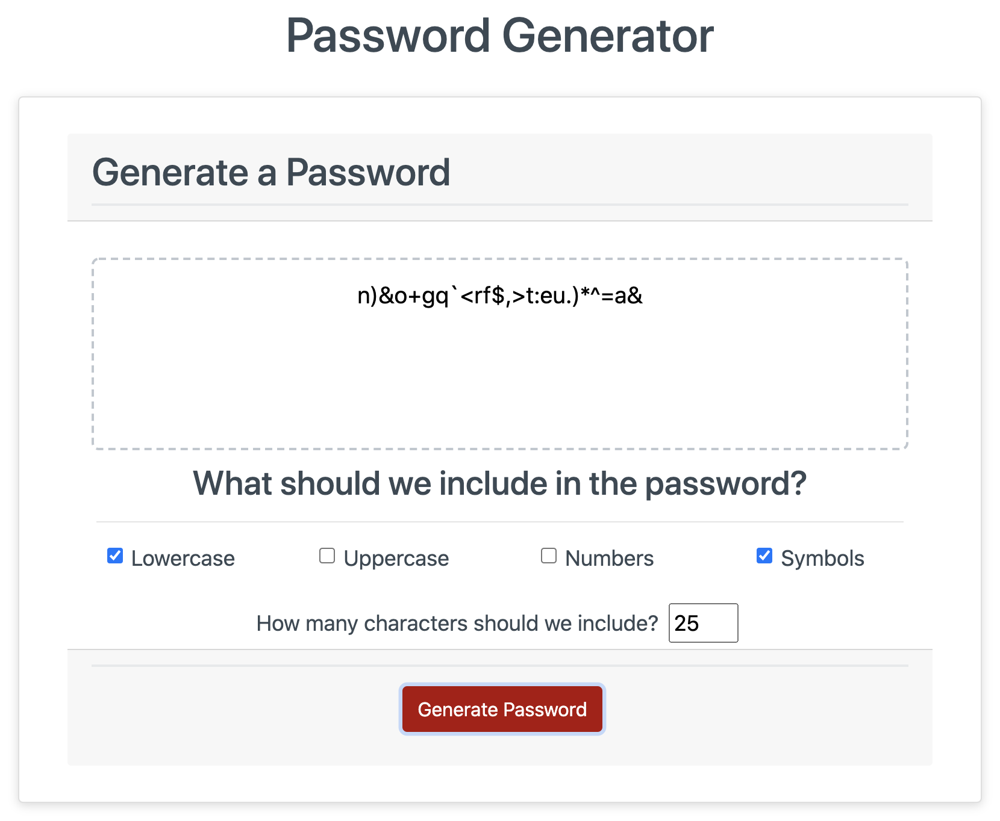
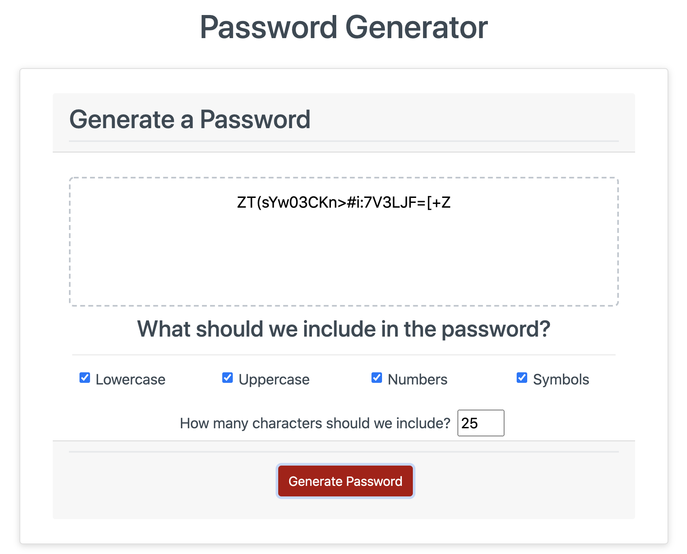

# Random Password Generator

A random password generator application that allows users to get a complex password at the click of a button. Utilizes checkboxes to allow the user to decide which characters they would like to include.

## About the Project

For this assignment we were asked to meet the following criteria:

    GIVEN I need a new, secure password
    WHEN I click the button to generate a password
    THEN I am presented with a series of prompts for password criteria
    WHEN prompted for password criteria
    THEN I select which criteria to include in the password
    WHEN prompted for the length of the password
    THEN I choose a length of at least 8 characters and no more than 128 characters
    WHEN prompted for character types to include in the password
    THEN I choose lowercase, uppercase, numeric, and/or special characters
    WHEN I answer each prompt
    THEN my input should be validated and at least one character type should be selected
    WHEN all prompts are answered
    THEN a password is generated that matches the selected criteria
    WHEN the password is generated
    THEN the password is either displayed in an alert or written to the page

### Built With

- <a href="https://getbootstrap.com/">Bootstrap</a>
- <a href="https://developer.mozilla.org/en-US/docs/Web/javascript">JavaScript</a>

## Getting Started

To run the program please visit the <a href="https://relizabet.github.io/Random_Password_Gen/">Password Generator</a> page.

### Examples of Program in Use

### Notes

- I initially was going to use one letter array and .toUpperCase, however, when I used this it gave me the same letter. Because of this I used two separate arrays
- I opted to split a string into an array for readability

## Authors

- **Rachel Campbell** - _complete work_ - [relizabet](https://github.com/relizabet)

## Acknowledgements

- <a href="https://github.com/othneildrew/Best-README-Template">Othneildrew for this README template</a>
- <a href="https://developer.mozilla.org/en-US/">Mozilla Developer Network</a>
